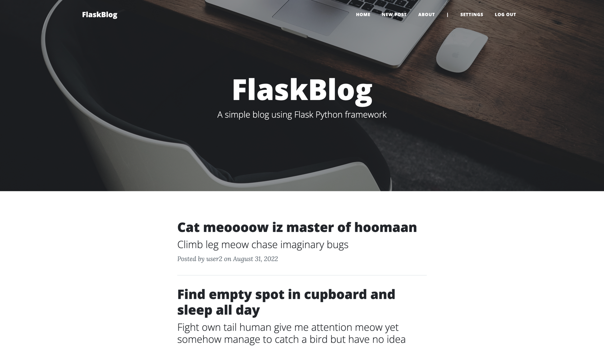

# FlaskBlog

FlaskBlog is a simple web app made with Flask on top of [Clean Blog](https://startbootstrap.com/theme/clean-blog/) theme by [Start Bootstrap](https://startbootstrap.com/).

## Info
It is a lightweight multi-user web blog using Python and [Flask](https://flask.palletsprojects.com/) 

Application users if they are not logged in can **view all the posts** in database and **view the full content** of the posts. They also have the option to **register** using their username and password. 
Registered and authorized users can **add new blog posts**, **edit** or **delete** existing ones (only authored by them), **log out** or **change their password**.

Database is built on [SQLite](https://sqlite.org/). All DB Management is done with [SQLAlchemy](https://www.sqlalchemy.org/). [Jinja](http://jinja.palletsprojects.com/) template engine is used to dynamically build HTML pages.

## Usage
1. Clone this repository using: `git clone https://github.com/venyxD/flask-blog.git`  
2. Go to the project root directory and install the virtualenv library using pip and create a virtual environment. Run the following commands respectively:
   * `pip install virtualenv`
   * `virtualenv venv`
   * `source venv/bin/activate`
3. Download the all dependencies in the requirements.txt using `pip install -r requirements.txt`
4. Start Flask’s built-in web server: `$ flask run`
5. Open your browser and view the app by opening the link http://127.0.0.1:5000/

* You are free to view recent posts, register, login add new posts etc.

6. To reinitialize sample database run `$ python init_db.py` from `tmp` folder. 

### Tech used
* Python 3
* Flask 2.2.2
* SQLite 3
* SQLAlchemy
* HTML5
* CSS3
* JavaScript
* Bootstrap 5.1.3
* Clean Blog 6.0.8
* Font Awesome 6.1.3
* Google Fonts API